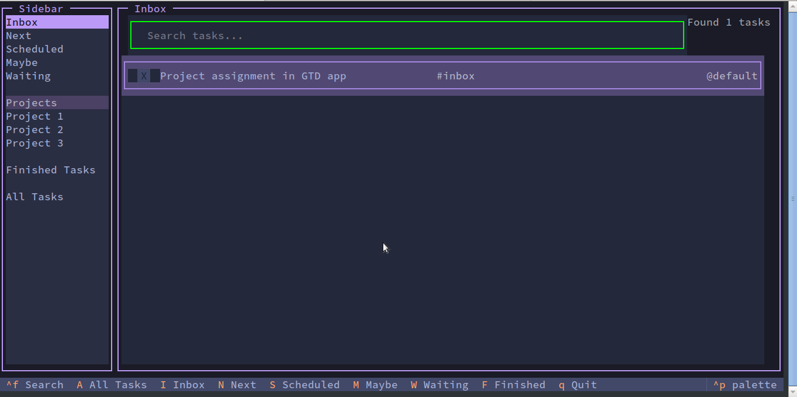
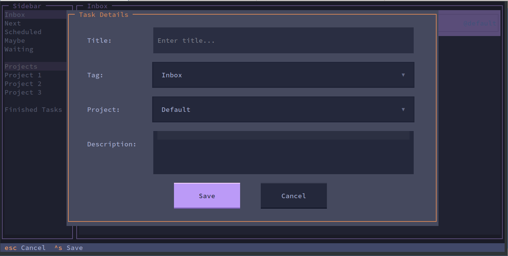

# GTD-Textual
A getting things done TUI based app using python textual

## Features
- Task management with different views:
  - Inbox: For new tasks
  - Next: For tasks to be done soon
  - Scheduled: For tasks with specific dates
  - Maybe: For potential future tasks
  - Waiting: For tasks waiting on others
  - Projects: For organizing tasks by project
  - Finished Tasks: For completed tasks

- Task organization:
  - Add, edit, and delete tasks
  - Mark tasks as complete/incomplete
  - Add descriptions to tasks
  - Schedule tasks for specific dates
  - Organize tasks by projects
  - Tag tasks for better organization

- User interface:
  - Clean terminal-based interface
  - Keyboard shortcuts for quick navigation
  - Sidebar for easy view switching
  - Task filtering and sorting

### Special features:
- Automatically move tasks from **scheduled** to **Next** based on scheduled date
- Automatically set date to **today** for overdue tasks

## Getting started:
Run `run.sh`

### Optional logging server (to view logs)
- Enable python environment (`source venv/bin/activate`)
- Run `python logger/server.py`

## TODO
- Project wise organization of tasks
- Show keyboard shortcuts in pop-up windows

## Screenshots
Task Screen:

New Task Form:

